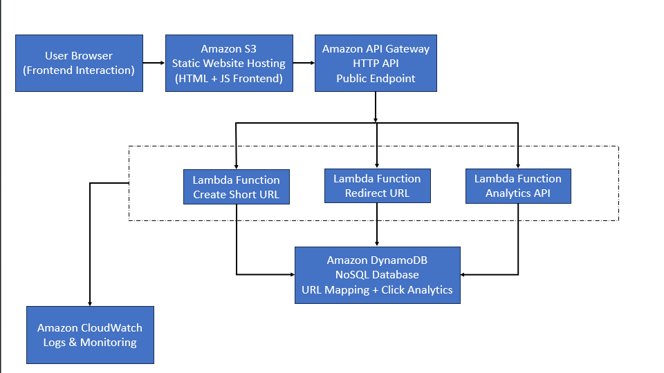
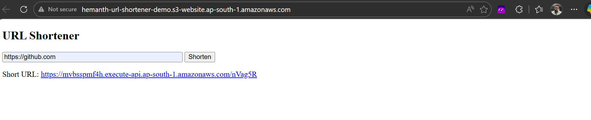
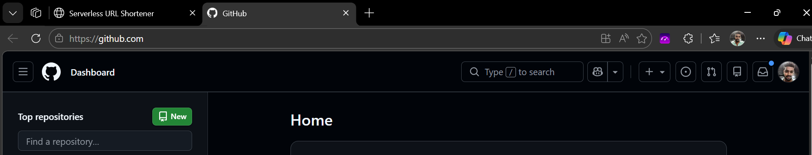
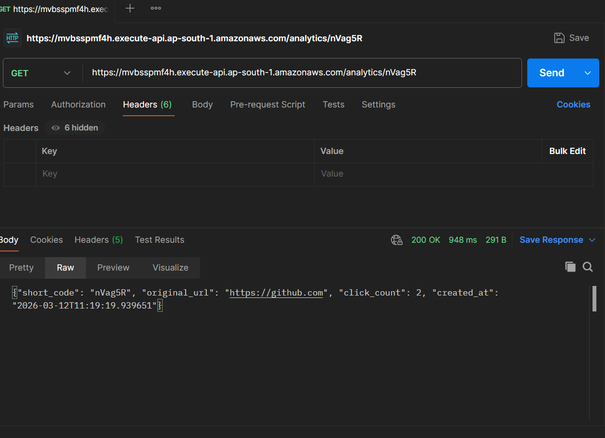
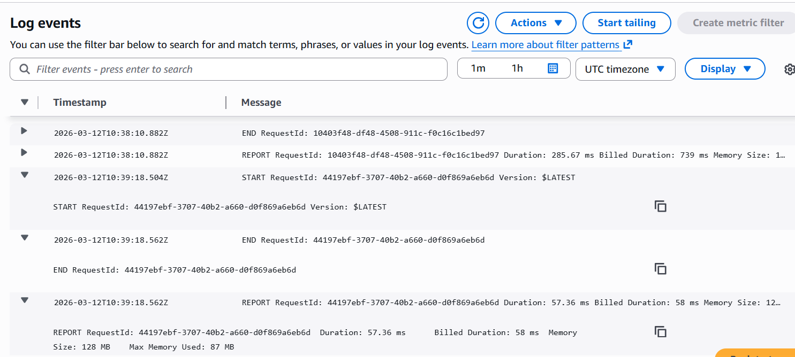

# Serverless URL Shortener with Analytics on AWS

## 📌 Project Overview

This project implements a fully serverless URL shortener system built on AWS.  
Users can generate short URLs, get redirected to original links, and track click analytics — all without managing any servers.

The system demonstrates real-world serverless architecture, API design, cloud observability, and secure IAM practices.

---

## 🚀 Architecture

User → S3 Static Website → API Gateway → AWS Lambda → DynamoDB  
Monitoring and debugging are handled using CloudWatch Logs.

---

## 🧩 Tech Stack

- AWS Lambda (Python)
- Amazon API Gateway (HTTP API)
- Amazon DynamoDB (NoSQL)
- Amazon S3 (Static Website Hosting)
- Amazon CloudWatch (Logs & Monitoring)
- AWS IAM (Least Privilege Security)

---

## ⚙️ Features

- Generate short URLs from long links
- Automatic HTTP redirect using short links
- Click analytics tracking
- Fully serverless backend (no EC2)
- Public static frontend hosting
- Secure IAM role configuration
- CORS-enabled API integration
- Production-style error handling and logging

---

## 🌐 Live Demo

Frontend Website:  
http://hemanth-url-shortener-demo.s3-website-ap-south-1.amazonaws.com

---

## 📸 Project Screenshots

### Architecture Diagram

### Short URL Generated

### Redirect Success

### Analytics API Response

### Lambda Execution Logs

---

## 🧠 Learning Outcomes

- Serverless application architecture design
- REST API implementation using API Gateway
- DynamoDB NoSQL data modeling
- Debugging and monitoring using CloudWatch Logs
- Handling CORS for browser-based API access
- Implementing IAM least privilege security
- Static website hosting on Amazon S3
- End-to-end cloud project deployment

---

## 📈 Future Enhancements

- Custom domain integration using Route53
- HTTPS enablement using CloudFront
- URL expiration using DynamoDB TTL
- Authentication layer using AWS Cognito
- Advanced analytics dashboard UI
- Rate limiting and API throttling

---

## 🏗️ Author

Hemanth Kumar